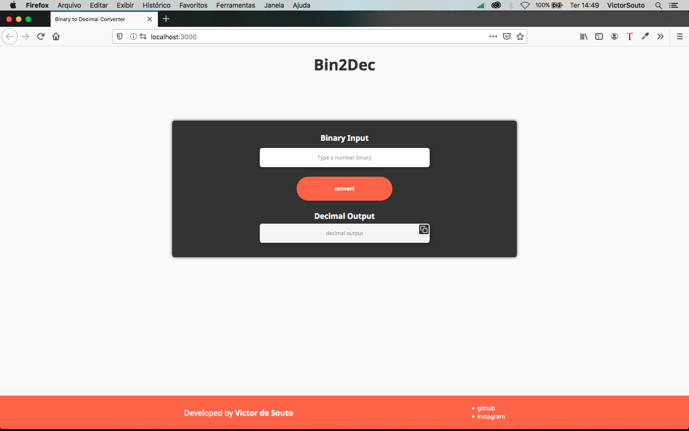

<h1 align="center">
Bin2Dec
</h1>

<p align="center">
A Binary to Decimal converter created with ReactJs
</p>

<p align="center">

</p>

## Techs

- ⚛[ReactJS](https://github.com/facebook/react)
- ♻️[Redux](https://redux.js.org/introduction/getting-started)
- 💅🏿[Styled Components](https://styled-components.com/)

## Getting Started

- Clone this repo ```git clone https://github.com/sudo-victor/converterBin2Dec.git```
- Install the dependencies ```yarn```
- Start the app ```yarn start```
